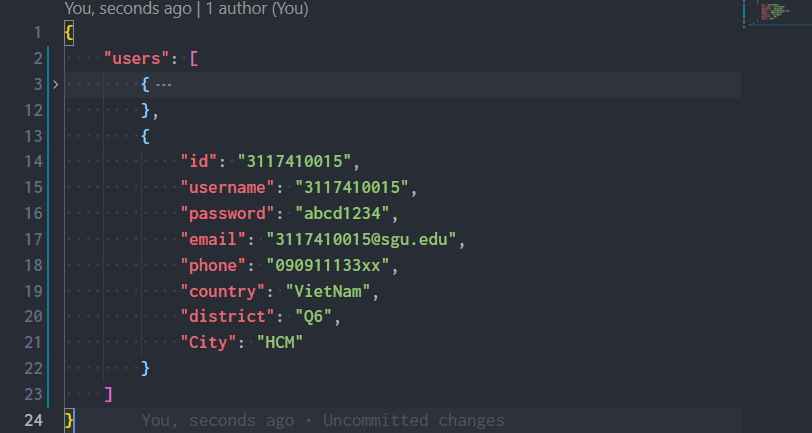
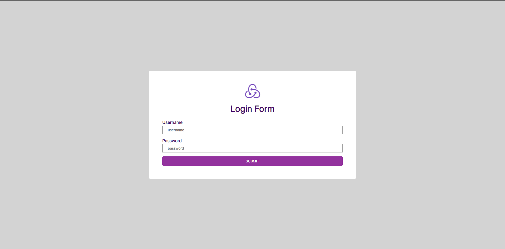
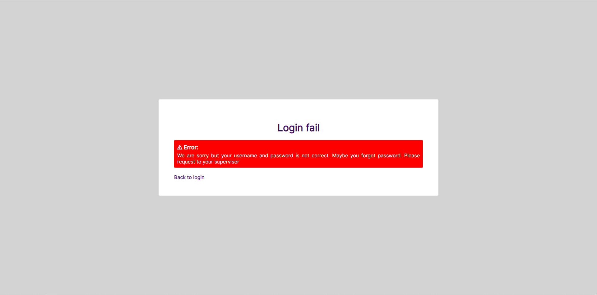
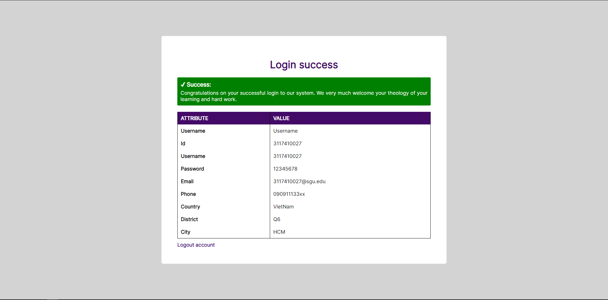
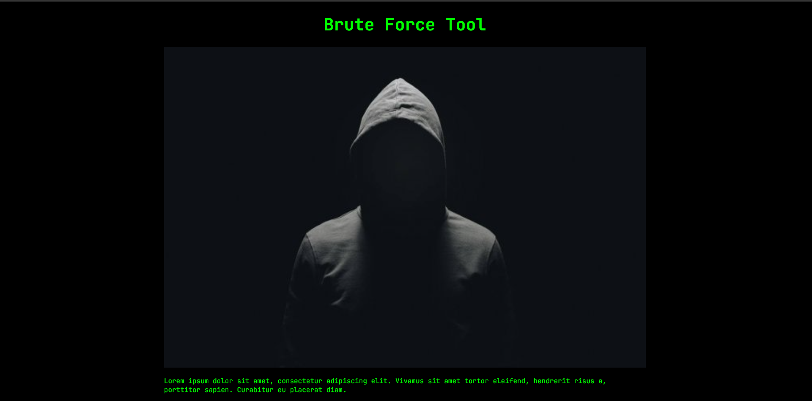
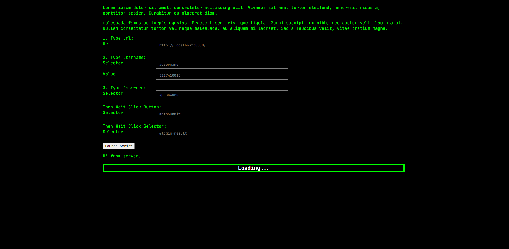
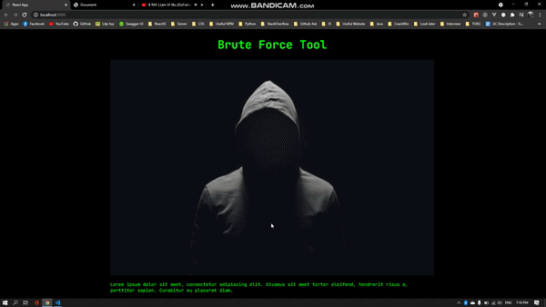

# Brute Force By Using Puppeteer

## For Testing

### Database

Ở đây chúng ta sẽ sử dụng json-server để tạo một fake database. Cấu trúc đơn thuần của nó là một json. Thư viện đã tích hợp sẵn các endpoint để chúng ta get dữ liệu.

Hình ảnh mô tả trong file db.json

Cách chạy database `npm run db`

### Server nạn nhân

Đây là một website tương trưng để làm mục tiêu bị tấn công. Sử dụng dữ liệu database vừa được chạy ở bước trên.

Hình ảnh trang web login của trang

Hình ảnh đăng nhập không thành công

Hình ảnh đăng nhập thành công

Chạy server `npm run sv`

### Hack Server

Đây là server để thực hiện tính toán các request kiểm tra tài khoản bằng việc sử dụng hình thức Dictionary BruteForce.

Server này chỉ giao tiếp với client bằng Socket để thực hiện realtime các số liệu.

AppHackReact là App được viết bằng React để thực hiện Hack Website nạn nhân và dùng puppeeter làm server để xử lý

Hình ảnh trang tấn công 1

Hình ảnh trang tấn công 2

**DEMO**

